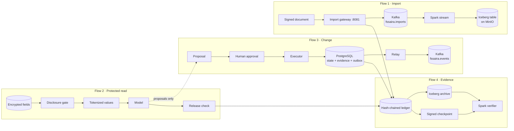

# End-to-end technical workflow

> **Documentation navigation:** [Documentation map](README.md) · [Start here](START_HERE.md) · [Full pipeline walkthrough](PIPELINE_WALKTHROUGH.md) · [Glossary](GLOSSARY.md)
>
> **Recommended next:** Run Flow 2 and Flow 3 locally with the two commands below, then follow the [full pipeline walkthrough](PIPELINE_WALKTHROUGH.md) for the service stack.

This page follows data through the whole system in plain steps. Each step names the code that runs, what gets saved, and how to look at it yourself. For byte-level detail, commands and failure analysis, use the [full pipeline walkthrough](PIPELINE_WALKTHROUGH.md).

Commands run from the inner `fssai-ra/` directory. Every record in the examples is synthetic.

## The picture

The system has four flows. Three of them handle data. The fourth, evidence, runs underneath all three.



**The one rule:** the model only ever *suggests*. Permission comes from a signed grant (to read) or a signed human approval (to change), and each flow checks it again for itself.

## Flow 1 · Import: an external document becomes a queryable row

| # | What happens | Code | What is saved | How to see it |
|---|---|---|---|---|
| 1 | A sender signs the document with its shared key and `POST`s it. With an `ingest_id`, the signature covers the ID, source, content type and text. | Client; `ImportBoundary.sign_envelope` | Nothing yet | — |
| 2 | The gateway checks type, size and signature. A bad request is quarantined. | `import_api.py`, `ImportBoundary._reject_reason` | A `quarantine` record in the import audit | HTTP `422 {"status":"quarantined"}` |
| 3 | A retry with an `ingest_id` it has already accepted gets the original answer. The same ID with different content is refused. | `import_api.py` (`seen` / `remember`) | `ingest-id` rows in the audit SQLite | `200 {"status":"duplicate"}` or `409` |
| 4 | Active content (scripts, iframes and similar) is stripped and the cleaned text is hashed. | `ImportBoundary._sanitize` | `ingest_intent` audit record | — |
| 5 | The cleaned record is published to Kafka, keyed by source. | `KafkaEventPublisher.append` | Kafka topic `fssaira.imports` | `kafka-console-consumer.sh` (walkthrough 9.4) |
| 6 | The gateway records success and answers `202`. | `ImportBoundary.ingest` | `ingest` audit record | `202 {"status":"accepted","broker_offset":N}` |
| 7 | Every 10 seconds Spark reads new offsets, rejects the whole batch if any row is malformed or its hash does not match, and merges the rest. | `jobs/kafka_to_iceberg.py` | Iceberg `imported_evidence` rows, keyed by **topic, topic generation, partition, offset** | Spark SQL (walkthrough 10.5) |
| 8 | Iceberg commits a new snapshot. Spark saves its checkpoint. A crash between the two replays the batch, and the MERGE key prevents a duplicate row. | Iceberg REST catalog, MinIO | Parquet data plus metadata in `s3://warehouse/` | `…imported_evidence.snapshots` |

Imported text is **not** encrypted and does **not** feed the model. Do not send personal data through this flow.

## Flow 2 · Protected read: a model sees only what a grant allows

| # | What happens | Code | What is saved | How to see it |
|---|---|---|---|---|
| 1 | Each declared field is classified by the domain profile. Undeclared fields fail. | `profiles/*.yaml` | — | `profiles/healthcare_record_access.yaml` |
| 2 | Each field is encrypted with AES-256-GCM. The key belongs to that subject and data class, and it is wrapped by a class key. The ingest credential can encrypt but cannot decrypt. | `key_custody.py` | Nonce and ciphertext in SQL. Keys stay in custody. | `02-encrypted-rows.json` |
| 3 | A policy owner issues a grant: holder, subjects, fields, purpose, expiry. | `disclosure.py` | Grant (HMAC-signed) | — |
| 4 | Before any record is fetched, the gate checks the grant, subject, field, purpose, consent and the model's zone. A denial never touches storage. | `DisclosureGate` | Decision in the evidence ledger | `report.json` → `denied_before_sql_read` |
| 5 | Only the allowed fields are decrypted, and names and subject IDs are replaced with session tokens. | `PrivacyGate`, `TokenVault` | Token mappings, encrypted | `03-model-values.json` |
| 6 | The model receives only `context.values`. | Model adapter | — | — |
| 7 | The output carries the labels of everything it was built from. Before release, the recipient, purpose and current grant are checked again. Names come back only for an entitled recipient. | `privacy_pipeline.py` | Release record with a SHA-256 of the released bytes | `04-output.json`, `05-evidence.json` |

Run all of it in one process, with no Docker:

```bash
.venv/bin/python scripts/pipeline_walkthrough.py --output work/flow2-demo
```

Custody keys, the token vault and grants live **in memory** in this reference implementation. A production deployment needs a key-management service and a persistent disclosure store (`FSSAI_DISCLOSURE_STORE`).

## Flow 3 · Change: an approved action changes state exactly once

| # | What happens | Code | What is saved (PostgreSQL, schema `fssaira`) | How to see it |
|---|---|---|---|---|
| 1 | A resource is registered in a starting state. | `ControlPlane.register_resource` | `resources` row; outbox event `resource.registered:<id>` | `GET /v1/resources/{id}` |
| 2 | Someone (a person, or a model through `/v1/propose-task`) proposes one exact transition. | `ControlPlane.propose` | `objects` (proposal); outbox `action.proposed:<request_id>` | `GET /v1/proposals/{id}` |
| 3 | A reviewer opens it. The server records when. | `begin_review` | `objects` (review session) | — |
| 4 | An authorized human approves. The approval is HMAC-signed and bound to the proposal's digest. | `ApprovalAuthority.approve` | `objects` (approval); outbox `action.approved:<approval_id>` | — |
| 5 | The executor re-checks signature, role, expiry and version, then commits **in one transaction**: intent evidence, the state change, the receipt, outcome evidence and the `action.executed` outbox event. | `AtomicExecutor.execute` | `evidence`, `resources` (v+1), `execution_results`, `approval_uses`, `event_outbox` | `GET /v1/proposals/{id}/evidence` |
| 6 | The relay publishes pending outbox events to Kafka in order and stamps them published. If Kafka is down, the request still succeeds, the events wait, and inline retries pause for 30 s so requests stay fast. | `OutboxRelay`, `SqlEventOutbox` | `event_outbox.published_at` | `/health` → `unpublished_events` |
| 7 | An independent consumer rebuilds a monitoring view and drops any event it has already seen (same `event_id`). | `EvidenceProjector` | In memory | — |
| 8 | Repeating the same request returns the original receipt, with no second change and no second event. | `validate_replay` | Nothing new | Response `replayed: true` |

Try it without Docker:

```bash
.venv/bin/python scripts/api_walkthrough.py --self-test
```

After a broker outage, call `POST /v1/recovery/reconcile` (platform operator). It publishes any backlog and reports `events_relayed` and `unpublished_events`.

**Redis** is an alternative to PostgreSQL for this flow, not a cache. It is used only when `FSSAI_DATABASE_URL` is unset. Its writes retry a bounded number of times under contention (`FSSAI_REDIS_MAX_ATTEMPTS`, default 64) and then fail closed with `STATE_CONTENTION`.

## Flow 4 · Evidence: anyone can check what happened

| # | What happens | Code | What is saved | How to see it |
|---|---|---|---|---|
| 1 | Every decision appends a record whose hash covers its predecessor. | `evidence.py`, SQL/Redis ledgers | `evidence` table or Redis list | `GET /v1/evidence/verify` |
| 2 | A notary signs the ledger's count and head hash with Ed25519. Keep the signature and public key **outside** the system that writes the ledger. | `evidence_notary.py` | Checkpoint JSON | `06-checkpoint.json`, `07-public-keys.json` |
| 3 | The ledger is copied into Iceberg. Each run appends only records newer than the archive holds, and refuses if the ledger was shortened or rewritten since. | `iceberg_backend.archive_evidence(ledger, store, ledger_id=…)` | `decision_evidence` rows keyed by `(ledger_id, seq)` | Report: `records`, `first_seq`, `last_seq` |
| 4 | A separate Spark job recomputes every hash and link, reports gaps and duplicates, and with a checkpoint also detects a deleted tail. | `jobs/verify_evidence_chain.py --checkpoint … --public-keys …` | — | JSON verdict `INTACT` / `COMPROMISED` |

A hash chain alone cannot notice that its last records were deleted. The signed checkpoint can.

## Where the flows meet

`POST /v1/propose-task` with a `governed_context` joins Flow 2 to Flow 3. The model's context comes only through the disclosure gate. The model's own label for how risky an action is gets ignored, and the server's capability catalogue decides instead (an unknown tool counts as `high_impact`). The response contains **proposals only**. Nothing changes until a human approves and the executor runs (Flow 3, steps 4–5).

Flow 1 is not connected to the model. Imported documents are stored for analysis and audit, not retrieved into prompts.

## When something fails

| Failure | What you observe | What the system does |
|---|---|---|
| Bad signature or type on import | `422 quarantined` | Records it; publishes nothing |
| Import retried after a lost response | `200 duplicate` (with `ingest_id`) | Returns the original offset; publishes nothing |
| Malformed row reaches Spark | Stream stops with an error | Writes nothing for that batch; an operator must repair or quarantine the row |
| Spark crashes after the Iceberg commit | Batch replays on restart | MERGE key prevents duplicate rows |
| Grant revoked after the model answered | Release denied | Saved output cannot be released |
| Approval reused or content changed | Execution denied | Nothing written |
| Kafka down during a change | Request succeeds; `unpublished_events > 0` | Events stay in the outbox until relayed |
| Redis under sustained contention | `STATE_CONTENTION` | Nothing written |
| Ledger tail deleted | Chain still verifies internally | Signed checkpoint and archive re-run both flag it |

## What code cannot close

These need an institution, hardware or independent people, and are tracked in [GAPS.md](GAPS.md): production key management (KMS/HSM), qualification of specific Postgres/Kafka/Spark deployments under load and failover, TLS and storage encryption in the deployed topology, a physical one-way link, human-review studies and independent security assessment.
