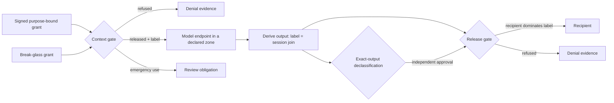

# Governed disclosure: the data half of the constitution

> **Documentation navigation:** [Documentation map](README.md) · [Start here](START_HERE.md) · [Policy route](README.md#policy-leader-route) · [Engineering route](README.md#ai-engineer-route) · [Glossary](GLOSSARY.md)
>
> **Recommended next:** See how disclosure composes with the other controls in [`PATTERNS.md`](PATTERNS.md), then run `fssaira disclosure profiles/healthcare_record_access.yaml`.

## Why a second rule is needed

The first rule of this architecture governs what an AI system may **do**:

> **A model may propose an action. It cannot manufacture the authority to
> execute it.**

That rule is necessary. For the systems institutions now build over sensitive
data, it is not sufficient. A clinical-record assistant, a corporate copilot over
confidential files, or a research agent over a cohort causes most of its harm
without executing anything. It reads. What it read goes into a prompt, travels to
a model endpoint, becomes a summary, and reaches whoever asked. None of that is a
state transition, so none of it reaches an executor, an approval check, or a
version check.

The second rule governs what an AI system may **see and release**:

> **A model may request information. It cannot manufacture the entitlement to
> see it, and it cannot launder what it saw.**

The two halves of that sentence are two different controls.

- **Entitlement** is checked before anything enters a model context.
- **Laundering** is prevented after the model responds, by labelling its output
  from what the session actually received rather than from what the model says.

## The failure most retrieval systems share

Most retrieval-augmented systems give a retrieval service a broad read credential.
They filter results by role and hand text back to the model. The output then
leaves as plain text. Three properties are missing from that design:

1. **Purpose.** A treatment grant is used for research, or an analysis grant for
   an external release. Role-based access sees the same role and permits both.
2. **Consent and revocation as live state.** A grant issued yesterday is honoured
   after the person withdrew consent this morning.
3. **Output labels.** Restricted data enters the context, a summary leaves, and the
   summary carries no label. The model is effectively asked to classify its own
   output. That is the data-path twin of a model declaring its own action low risk.

`fssaira disclosure` runs every hostile flow against three gates to make the gap
measurable rather than rhetorical.

| Architecture | What it is | What it misses |
|---|---|---|
| `unguarded` | retrieval with a service-account read credential and free text out | everything |
| `access_controlled` | signed, holder-bound, expiring, class-cleared grants plus an output check on the label the model claims | purpose, subject scope, minimum necessary, live consent, endpoint residency, emergency-access bounds, session taint, and independent declassification |
| `this_architecture` | all thirteen checks below | the limits stated at the end of this page |

Generated results for every pack are in
[`../evaluation/results/v1.0.0-governed-disclosure.json`](../evaluation/results/v1.0.0-governed-disclosure.json)
and summarised in [`../evaluation/results/RESULTS.md`](../evaluation/results/RESULTS.md).

## The label lattice

Every value the gate releases carries a label with four parts. When data is
combined, the join only ever tightens.

| Part | Meaning | Join when two inputs combine |
|---|---|---|
| `classes` | sensitivity classes present | union, so more care is required |
| `subjects` | people or entities concerned | union, so more people are affected |
| `purposes` | uses still permitted | intersection, so fewer uses remain |
| `zones` | places the data may be processed | intersection, so fewer places remain |

This is the data-flow counterpart of delegation's attenuation rule. **Authority
only narrows as it travels through agents. Restriction only accumulates as data
travels through models.** Both properties can be checked in one pass without
trusting any component's account of itself.

## The lifecycle



1. **Grant.** An accountable issuer signs a grant naming holder, purpose,
   subjects, fields, classes, basis, and expiry. The holder cannot issue their own
   grant, except for declared emergency access.
2. **Context.** The gate holds the record-store credential. It releases only the
   intersection of what was granted, what was asked, what consent currently
   permits, and what the model endpoint's zone may process. A request must name
   subjects and fields. There is no "all".
3. **Derive.** The gate labels every output with the join of everything released
   into that session. The model's claimed label is recorded, with a downgrade flag,
   and ignored.
4. **Declassify.** Only a rule declared in the domain pack can lower a label. It
   needs an approval bound to the exact output digest, from the declared role, by
   someone other than the holder. The gate applies the transform itself.
5. **Release.** The recipient must dominate the label in classes, purpose, zone,
   and subject scope.
6. **Review.** Every emergency access opens a review obligation. A holder with too
   many unreviewed emergency accesses is refused further ones.

Every step writes an intent record before it decides and an outcome record after.
If the intent cannot be written, nothing is released. Records hold field names,
codes, and digests. They never hold the protected values, because a disclosure log
that reproduces the disclosure is a second copy of the data under weaker control.

## The thirteen checks

Each check has stable denial codes. Each one is removed in turn by the ablation,
and removing any one lets a named harm through.

| Check | Refuses | Example hostile flow |
|---|---|---|
| `grant_signature` | grants altered after signing or signed by an untrusted key | subjects widened on a signed grant |
| `holder_binding` | another principal's grant, a self-issued grant, another principal's session | borrowed grant, the confused deputy |
| `grant_currency` | expired or revoked grants | grant revoked when a project closed |
| `purpose_binding` | undeclared purposes and purpose switches | treatment grant used for model training |
| `subject_scope` | subjects outside the grant | an injected "also pull the next patient" |
| `minimum_necessary` | fields outside the grant | a request that quietly adds a field |
| `consent` | purposes the subject has withdrawn | consent withdrawn after the grant was issued |
| `class_clearance` | classes outside the grant | a field above the grant's clearance |
| `residency` | classes the endpoint's zone may not process, and undeclared endpoints | restricted data to a public model API |
| `break_glass` | emergency access outside declared purposes, too long, unjustified, or with review overdue | repeated emergency access without review |
| `session_taint` | outputs labelled by the model's claim | a restricted summary self-labelled as unrestricted |
| `recipient_clearance` | recipients that do not dominate the label | an honest output sent to personal email |
| `exact_output_declassification` | label lowering without an independent exact approval | a holder approving their own de-identification |

## Declaring a policy in a domain pack

A `disclosure` section sits beside `governance` and `transitions`. The healthcare
and corporate packs ship complete examples.

```yaml
disclosure:
  subject_kind: patient
  purposes: [treatment, research, emergency-treatment, patient-access]
  fields:
    diagnosis: {class: highly-restricted}
    medications: {class: synthetic-health-record}
  model_endpoints:
    on_premises_model: on-premises
    public_model_api: external
  class_zones:
    highly-restricted: [on-premises]
    synthetic-health-record: [on-premises, approved-cloud]
    de-identified: [on-premises, approved-cloud]
  recipients:
    treating_clinician:
      classes: [synthetic-health-record, highly-restricted]
      purposes: [treatment, emergency-treatment]
      zone: on-premises
    patient_portal:
      classes: [synthetic-health-record, highly-restricted]
      purposes: [patient-access]
      zone: on-premises
      subject_scope: self
  declassification:
    - name: deidentify_for_research
      from_classes: [synthetic-health-record, highly-restricted]
      to_class: de-identified
      purposes: [research]
      approval_role: research_review_authority
      removes_subject_identity: true
  break_glass:
    purposes: [emergency-treatment]
    max_ttl_seconds: 3600
    max_unreviewed_per_holder: 1
    review_role: emergency_access_reviewer
```

The loader cross-checks the section against the rest of the pack and fails at load
time when a policy reads well but cannot be enforced as written.

- Every field and declassification class must appear in `governance.data_classes`.
- Every class in use must declare the zones where it may be processed.
- Every purpose used by a recipient, rule, or emergency policy must be declared.
- Every declassification approver and emergency-access reviewer must be a role
  that some transition enforces. A review nobody is required to perform is
  concealment, not oversight.

## Commands

```bash
fssaira disclosure profiles/healthcare_record_access.yaml
fssaira disclosure profiles/corporate_confidential_data.yaml --output /tmp/disclosure.json
fssaira profiles --verify          # includes disclosure assurance for every declaring pack
make disclosure
```

The suite is generated from the pack's own policy. A new pack gets the same hostile
flows, ablations, and bounded model check without domain-specific test code.
A scenario whose preconditions the pack does not declare is reported as not
applicable. It is never counted as contained.

## Invariants checked by bounded enumeration

- **DX-1** No protected value enters a model context unless a trusted, holder-bound,
  current grant for this purpose covers every subject, field, and class. Consent
  must permit it, the endpoint's zone must be allowed, and emergency access must be
  bounded.
- **DX-2** Every read attempt leaves one intent and one outcome record. An attempt
  whose intent cannot be recorded releases nothing.
- **DX-3** A released context is labelled with exactly what it contains. A
  session's label never becomes less restrictive.
- **DX-4** An output reaches a recipient only if the recipient dominates the
  session label, or a valid exact-output declassification lowered it. The model's
  claimed label changes nothing.
- **DX-5** Every emergency access opens one review obligation. No holder exceeds
  the declared unreviewed limit.
- **DX-6** No protected value is written to the evidence ledger.

Contract domain 9 in [`../contract/9_governed_disclosure.yaml`](../contract/9_governed_disclosure.yaml)
states these as seven-field requirements. [`fssaira coverage`](ASSURANCE.md) checks
that each is bound to a test that exists.

## Mapping to real systems

The gate is an interface, not a product. A deployment keeps the checks and replaces
the mechanisms.

| Gate duty | Typical production mechanism |
|---|---|
| Signed purpose-bound grants | OAuth 2.0 token exchange or rich authorization requests, SMART on FHIR scopes, or an institutional access-request service |
| Policy evaluation | an attribute-based policy engine such as Open Policy Agent or Cedar, fed by the pack's declarations |
| Record-store credential held by the gate | a retrieval service or data-access proxy that is the only holder of database, vector-store, or document-store credentials |
| Labels on stored data | classification tags in the data catalogue, carried as metadata on every chunk in the vector index |
| Residency | an egress-controlled model gateway that resolves each endpoint to an approved zone |
| Live consent and revocation | a consent-management service queried at read time, not copied into tokens |
| Session labels and release | a response gateway that tracks per-session labels and enforces recipient clearance before delivery |
| Declassification | a de-identification or aggregation service invoked only with an exact-output approval |
| Evidence without content | the hash-chained ledger here, or an append-only audit store holding digests |

## What this does not establish

- Redacting released values is not de-identification. Re-identification risk is
  not measured.
- Session taint labels whole sessions. It over-restricts outputs that ignored most
  of their context, and that utility cost is reported rather than hidden.
- A model can paraphrase, encode, or infer values. Those are governed only because
  the whole session is labelled. Nothing here detects them in content.
- Purposes, consent semantics, and recipient clearances are institutional
  declarations. They are not validated against any law.
- All results come from synthetic records and an in-process gate. No real record
  system, model endpoint, or delivery channel is exercised.
- The reference HTTP API reports the declared policy on `/v1/profile`. It does not
  yet place the disclosure gate in front of its own model-proposal route. That
  integration remains open in [`GAPS.md`](GAPS.md).
