# Trust by Construction: Secure-by-Design Patterns for Agentic AI in Learning Institutions
Scale Intelligence Without Scaling Implicit Authority

Rachna Srivastava
Enterprise Architect | AI Systems Researcher | Independent work, in a personal capacity
genaiworks@gmail.com | UNU Macau AI Conference 2026 | Extended abstract
AI × Education: AI for Learning, Learning for AI

## Introduction

AI agents in learning institutions can read student records, change systems and delegate to other agents. A transcript assistant should retrieve the named record, propose a correction and deliver the approved result to the registrar. It should not open another student's file because a document tells it to, approve its own correction, or keep releasing data after revocation. Indirect prompt injection can redirect tool-integrated agents [1].

The harder problem is that permitted steps combine into an outcome no one allowed. A reader, a summariser and a publisher may each hold a sound tool list and still form a path from a transcript to a public page. Each step meets its local rule; the chain breaches the task boundary.

Trust by Construction treats every agent, its coordinator included, as an untrusted proposer. Separate services mediate protected reads, delegation, effects and disclosure under one rule: proof before power. The contribution is ten patterns for executable policy refusals, a proposed composition contract for delegated work, and an offline evidence kit.

The work builds on control-flow separation [2], information-flow control [3] and agent design patterns [4]. It integrates these approaches around delegated authority, shared budgets and revocation. The aim is an integration and test method, not a new primitive. Proof means checking stated rules against trusted state, not that a model is truthful or a grade fair.

## Development Section 1 Methodology Core Argument and Case Context

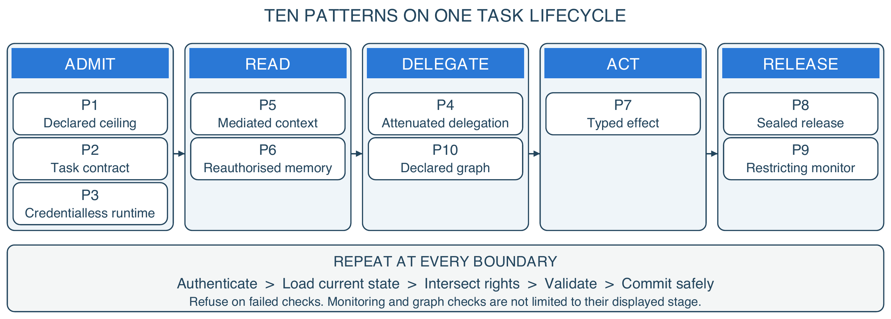

Figure 1. Ten patterns across one task lifecycle. Columns show each pattern's primary stage.

The model makes proposals. Separate, trusted software decides which operations may run. A task contract has seven fields: task, purpose, subject, tenant, scope, budget and expiry, where scope is an exact-match set over nine axes and budget a ceiling over six. Scoped leases let an agent call the gateway without letting it rewrite the policy. The ten patterns are a declared authority ceiling (P1), a task contract (P2), a credentialless runtime (P3), attenuated delegation (P4), mediated context (P5), reauthorised memory (P6), typed effects (P7), sealed release (P8), a restricting monitor (P9) and a declared task graph (P10).

The threat model allows malicious or colluding agents, poisoned content and a monitor that is wrong. It assumes trusted enforcement code and operators, protected state and adapters that cannot be bypassed. A purpose picks an approved operation and resource policy; it does not establish what the agent means.

Every boundary does the same five things: authenticate the caller, load current state, intersect rights, validate the exact operation, then commit. The case makes it concrete. A registrar asks for a grade correction. The assistant may read the named record, because the lease names that record and no other. It drafts a change, but the write is refused until the instructor confirms, because the contract names a second approver. The approval binds to the exact draft, so a different write cannot reuse it. Revoke the grant mid-task and the queued write fails, even though it was approved when it was drafted.

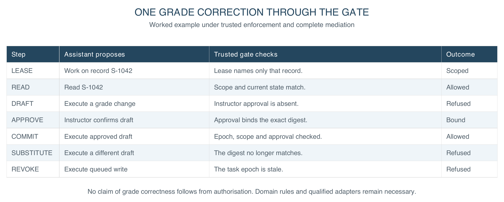

Figure 2. One grade correction, end to end. Trusted services check stated rules at each boundary under the declared enforcement assumptions.

The design hypothesis is falsifiable: under an unchanged contract, adding workers must not admit a prohibited effect, information path or total spend. That must be checked on the whole composition, not on each worker.

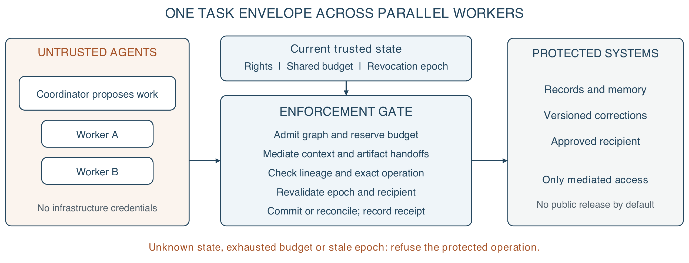

Figure 3. Proposed swarm extension. Parallel workers share one task budget and revocation epoch; every handoff crosses enforcement. The diagram specifies architecture, not measured distributed performance.

A swarm is a set of agents on one institutional task. The coordinator may split work and propose workers, but spawning is itself mediated. Each child gets its own identity, an expiry and authority no wider than its ancestors, task and workload ceiling; per-agent identity supports traceability [5]. Replanning changes the task graph, and a trusted gate must admit each new node and edge before use. Agreement among agents is evidence for review, never a credential.

Parallelism must not multiply resources. All descendants share limits for calls, context and memory bytes, traffic bytes, compute units and cost, plus a workload ceiling across tasks. Depth, population and time limits bound recursive spawning. Atomic reservations precede dispatch; completion or cancellation settles them without double spending. External effects need adapter reconciliation when the outcome is unclear: a rollback cannot unsend an email.

Information composes the same way. Trusted mediation binds source labels to artifacts and messages, so agents cannot strip them by rewording or dropping citations. Outputs inherit restrictions from all exposed context, including memory. Reuse with a clean context needs a new isolated context; an agent's claim to have forgotten is not enough. Combining inputs intersects recipients and purposes, and relaxation needs a separately authorised release. This can over-restrict useful summaries, a deliberate trade.

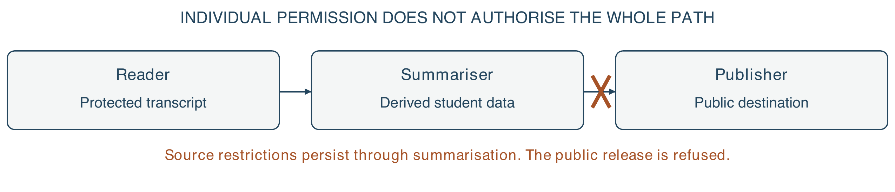

Figure 4. Composition changes the security question. A tool allowlist does not stop a permitted publisher disclosing another agent's protected input. Labels and recipient checks must survive the handoff; agreement among agents supplies no release authority.

At fan-in, a trusted gate checks provenance, authority, artifact identity and destination before accepting results. Revocation raises the task epoch, so queued work, stale leases and later release chunks fail revalidation. Disclosed information cannot be recalled. A fresh check alone leaves a check-then-act race: strict revocation needs authorisation and commit serialised against it, or an adapter that rejects stale epochs. Partitioned workers must stop when freshness cannot be shown, trading availability for bounded authority. Physical isolation, egress control and connectors stay deployment duties.

## Development Section 2 Results Analysis and Impact

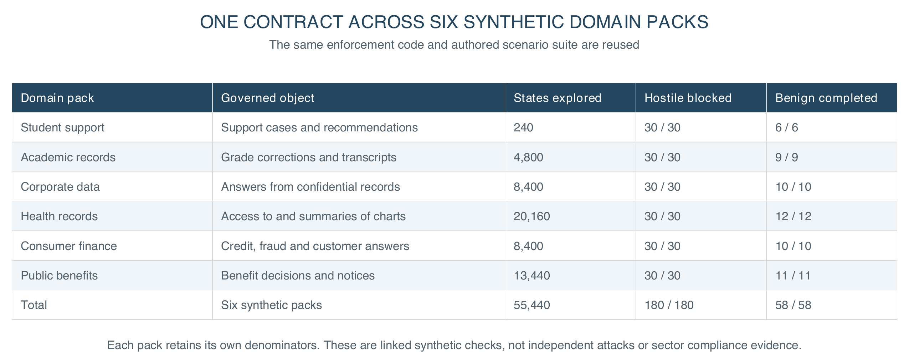

Figure 5. One evaluation approach across six synthetic sector profiles. Domain policies and permitted transitions vary; each pack requires its own evidence.

The FSSAI-RA reference kernel runs offline, without model weights or a GPU. One contract and one refusal suite cover six synthetic packs: student support, academic records, corporate data, health records, consumer finance and public benefits. Across them the evaluation explores 55,440 bounded configurations with no violation, 180 hostile scenarios, all contained, and 58 benign workflows, all completed [6]. The packs reuse an authored scenario suite: these are linked synthetic checks, not 180 independent attacks, outside validation or reliability estimates.

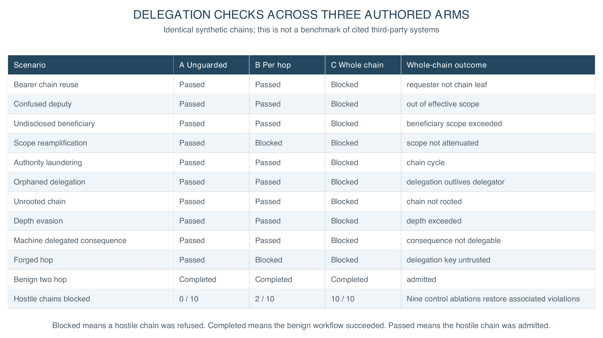

Figure 6. Ten synthetic delegation risk classes across three authored architectures. Blocked means a hostile chain was refused; Completed means the benign chain succeeded.

Four findings explain why these checks matter. First, composition is not covered by local correctness. Against ten delegation attacks, an unguarded chain contained none, per-hop validation against the immediate delegator contained two, and whole-chain verification contained ten. These are authored baselines, not evaluations of those cited systems. Removing each of nine controls restores its associated violation in the ablation suite.

Second, sequence testing found what step testing missed: a stateful harness caught a summary drafted while access was valid but released after consent was withdrawn, which single-step enumeration passed. Release now rechecks live state; removing it brings the violation back.

Third, the academic-records profile exposed an approval role omitted from the runtime map, which covered only consequential rules. The fix enforces declared roles on every transition; regression tests cover refusals and valid approvals.

Fourth, a simulation models finite oversight. Across forty cases, simulated reviewers attentive for the first 2, 4, 8 or 16 cases produced 5, 5, 4 and 3 harmful approvals. A minimum review time deferred work to a manual route and prevented these simulated approvals. No human reviewers were observed; waiting longer does not establish careful judgment. Manual-route outcomes were not evaluated.

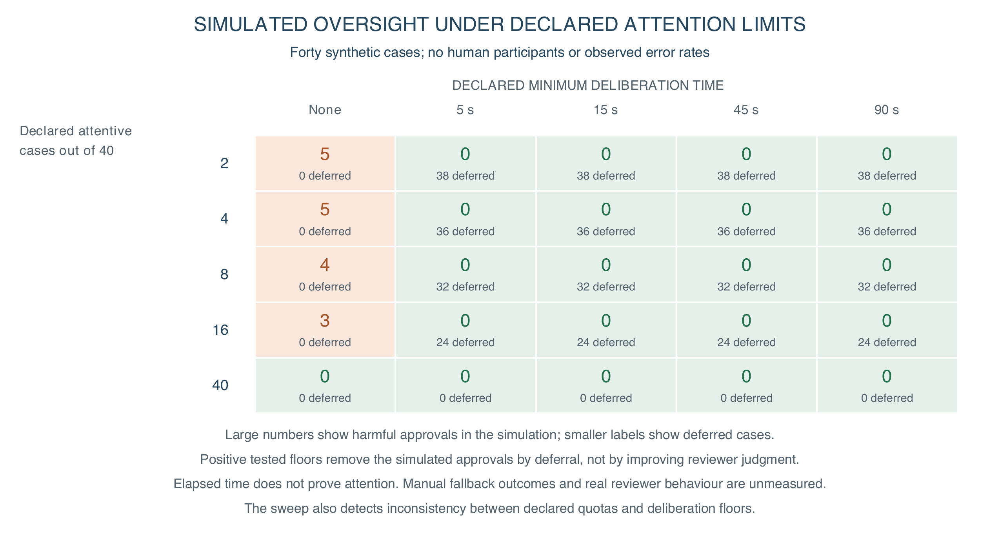

Figure 7. Simulated oversight under declared attention budgets. Cells show harmful approvals in forty synthetic cases. Deferral removes the tested simulated approvals; no human reviewers were observed, and elapsed time does not establish careful judgment.

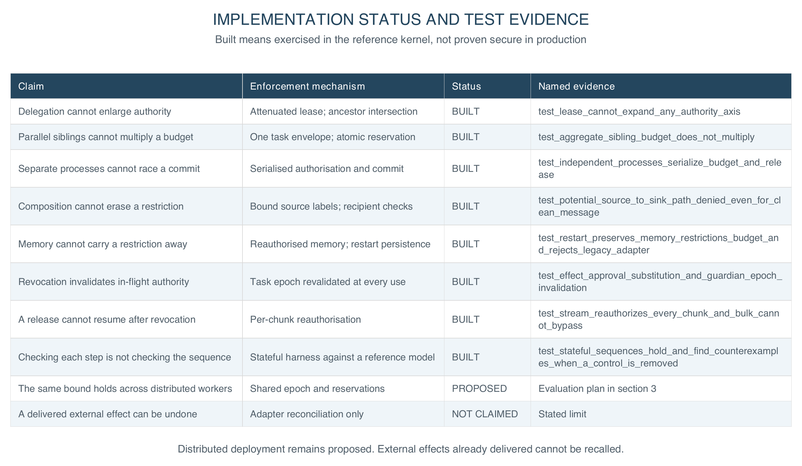

Figure 8. Implemented controls and proposed extensions. Named tests exercise bounded instances of each claim; they do not establish universal guarantees.

Eight implemented controls have named regression tests for authority growth, shared budgets, inherited restrictions and stateful sequences. Passing these tests supports the bounded claims under the stated assumptions; it does not prove them for all inputs. Every comparison arm completed its benign fixtures with no false denials in that set. These limited fixtures establish neither general utility nor latency, staffing or deployment cost. The same bound across distributed workers is specified, not evaluated. Undoing a delivered external effect is not claimed.

The next evaluation should compare an unmediated swarm, local controls, shared enforcement and a deny-all baseline under one workload, raising worker count and depth, and run against a public injection benchmark [7]. A single prohibited composite outcome falsifies the claim.

Security stays conditional on complete mediation and sound policy. A compromised enforcer, covert channel or permissive policy invalidates containment; a malicious monitor can deny service without escalating privilege. Authorised actions may still be inaccurate, discriminatory or harmful, so review, appeal, accessibility and pedagogical evaluation stay necessary. A decision receipt binds policy version, task epoch, source lineage, artifact digest, recipient and outcome, so review need not treat model reasoning as proof. Receipts need access controls and retention limits, so the trail is not another store of student data.

For institutions, trust becomes something a buyer can demand and an auditor can rerun: named enforcement points, a filled contract, declared review limits and fresh evidence. Procurement can require the refusal suite before signing; a regulator can check purpose and revocation as running controls, not text. A model or vendor change requires fresh adapter checks and the same refusal tests. Sovereignty becomes control of keys, data flow and exit, not server location.

## Conclusion

For AI for Learning, a registrar can inspect record access, correction authority and release destinations. Institutions should deploy bounded, reversible workflows first, qualify connectors, and evaluate with staff and students before expanding autonomy. A named owner must handle escalation and appeals, and students must be told how to contest a result. Institutions must validate review capacity in practice; excess work should queue or reduce autonomy rather than rely on nominal approval.

For Learning for AI, learners can inspect a forged approval, poisoned memory and a colluding agent chain, then observe which boundary refuses each action. This complements UNESCO's human-centred AI competency agenda [8] with practical understanding of authority and redress, and offline verification reduces computing needs for the teaching lab.

The design aims to support SDG 4 through accountable school workflows and SDG 16 through contestable institutional authority; educational outcomes remain to be evaluated. Because the contract is enforced outside the model, institutions can require the same authority contract and refusal suite across model and vendor changes, so governance attaches to a workflow whose authority can be withdrawn rather than to a vendor's assurances.

More capable models introduce risks beyond authority control. This contribution addresses one tractable requirement: increased autonomy must not silently expand an institutional mandate.

## References

[1] Zhan, Q., et al. (2024). InjecAgent: Benchmarking Indirect Prompt Injections in Tool-Integrated Large Language Model Agents. Findings of ACL. https://arxiv.org/abs/2403.02691

[2] Debenedetti, E., et al. (2025). Defeating Prompt Injections by Design. arXiv:2503.18813. https://arxiv.org/abs/2503.18813

[3] Costa, M., et al. (2025). Securing AI Agents with Information-Flow Control. arXiv:2505.23643. https://arxiv.org/abs/2505.23643

[4] Beurer-Kellner, L., et al. (2025). Design Patterns for Securing LLM Agents against Prompt Injections. arXiv:2506.08837. https://arxiv.org/abs/2506.08837

[5] Chan, A., et al. (2024). Visibility into AI Agents. ACM FAccT. https://arxiv.org/abs/2401.13138

[6] Srivastava, R. (2026). FSSAI-RA reference implementation. Repository snapshot 9bb35a1. Evidence: fssai-ra/evaluation/results/; regression tests: fssai-ra/tests/test_tbc_sdk.py, test_delegation.py and test_generalization.py. https://github.com/genaiworks/fssai-ra/tree/9bb35a1

[7] Debenedetti, E., et al. (2024). AgentDojo: A Dynamic Environment to Evaluate Prompt Injection Attacks and Defenses for LLM Agents. NeurIPS Datasets and Benchmarks. https://arxiv.org/abs/2406.13352

[8] UNESCO (2024). AI Competency Framework for Students. https://unesdoc.unesco.org/ark:/48223/pf0000391105

## Implementation appendix

Supporting material. The submitted extended abstract is the four sections above; this appendix is for the reader who intends to build it. This work was carried out independently and in a personal capacity: it does not represent the position of the author's employer or of any other institution, and the implementation, the evaluation and every figure here are the author's own.

The architecture is not specific to education. One contract and one refusal suite cover the six packs in section 3, and the worked case in Figure 2 requires domain-specific policy, approval roles and qualified adapters when applied to a patient chart or a benefits claim.

### A. The ten patterns, as contracts you can implement

A pattern here is not advice. Each names a rule, the refusal it must produce when that rule is broken, and where it binds in the reference kernel. A pattern with no refusal is not implemented.

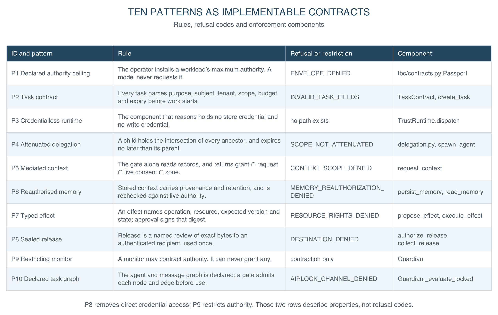

Figure 9. The ten patterns as implementable contracts. Refusal codes are the stable strings the reference kernel returns; they are what an auditor greps for and what a test asserts on.

### B. The two artifacts everything else hangs from

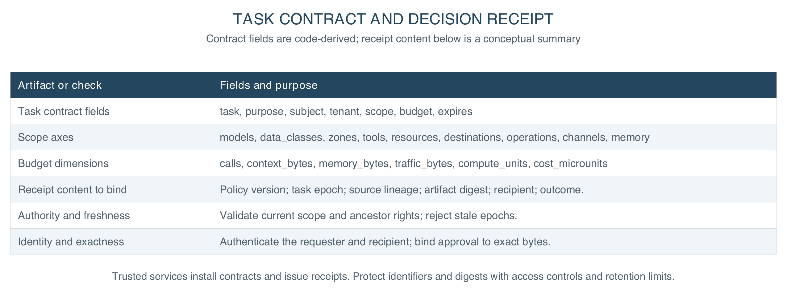

Figure 10. The task contract and the decision receipt. Scope is exact-match: there are no wildcards, and an unknown identifier is a refusal rather than a match.

A task contract is what an institution fills in before an agent starts; a decision receipt is what it reads afterwards. Both are small, both sit outside the model, and every refusal in Figure 9 is a comparison between them and live state.

### C. The order to build it in

Nothing here requires adopting all ten patterns at once. Each stage below is independently useful, ships a refusal a buyer can test, and names what is still open after it.

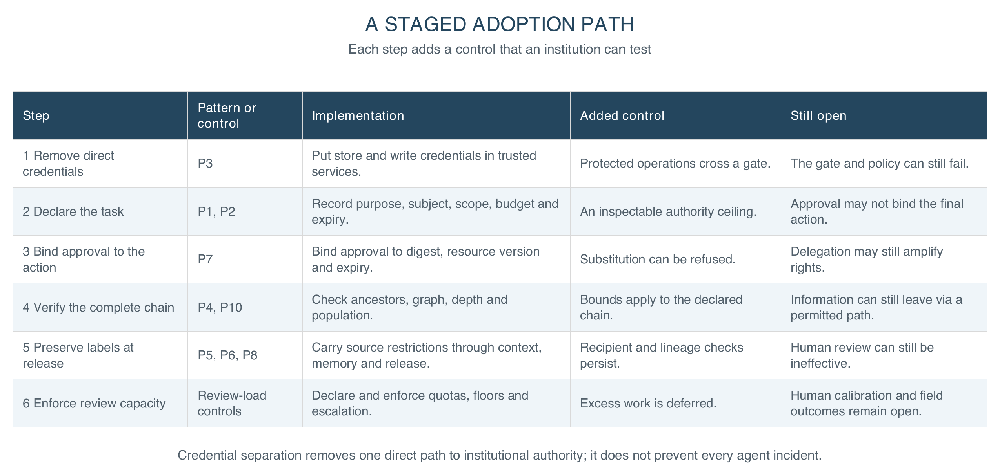

Figure 11. Six staged adoption steps, with the control each adds and the assurance that still requires evaluation.

### D. What this adds to the work it builds on

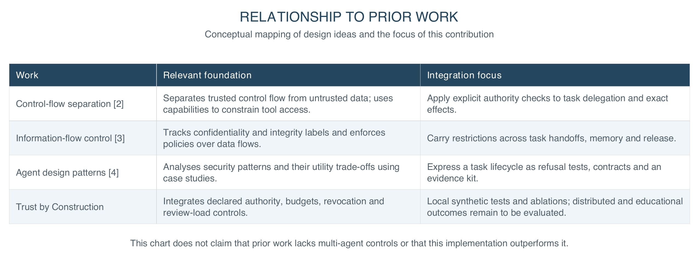

Figure 12. Relationship to prior work. The contribution integrates existing control and information-flow ideas with task-wide authority, budgets and revocation. This is a conceptual mapping, not a head-to-head benchmark.

### E. Reproducing every number in this paper

The kernel requires no model weights or GPU. After installing the dependencies, run from the fssai-ra directory. Transport tests use local sockets.

    pip install -e ".[dev]"                # include test dependencies
    pytest                                # the full offline suite
    python scripts/generate_results.py --check     # committed results match a fresh run

The result-generation command checks the committed evaluation artifacts against a fresh run and also exercises local transport. Every count in section 3 is a fixture observation on synthetic packs authored here: evidence that the controls bind where the paper says they bind, not a field outcome and not a claim about educational benefit.
